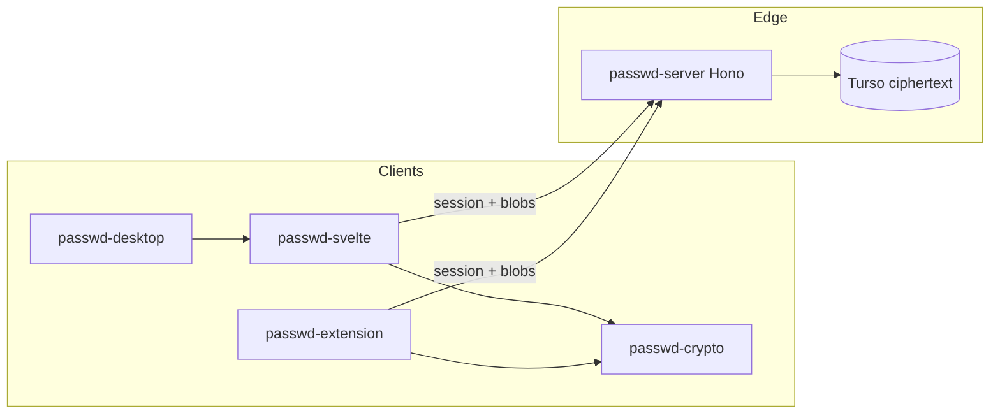

# Passwd

Zero-knowledge password manager — free-tier stack (SvelteKit, Cloudflare Workers, Turso, client-side crypto).

This directory is an **npm workspaces monorepo**. Packages live as sibling `passwd-*` folders under one git root. Encryption keys never leave the client.

## Packages

| Package | Role |
|---------|------|
| [`passwd-crypto`](./passwd-crypto) | Shared client crypto (Argon2id, XChaCha20-Poly1305, Secret Key, sealed-box wrapping) |
| [`passwd-server`](./passwd-server) | Hono API on Cloudflare Workers + Turso (ciphertext only) |
| [`passwd-svelte`](./passwd-svelte) | SvelteKit web app (Cloudflare adapter) — Hallmark UI |
| [`passwd-extension`](./passwd-extension) | WXT browser extension (autofill) |
| [`passwd-desktop`](./passwd-desktop) | Tauri desktop shell around the web UI |

## Architecture



**Invariant:** a fully compromised server must not yield vault plaintext. See [docs/data-flow.md](./docs/data-flow.md) and `.cursor/skills/passwd-zero-knowledge`.

## Agent skills

Project skills are **committed** under [`.cursor/skills/`](./.cursor/skills/) so other agents and clones can use them:

- `passwd-architecture` — package ownership + scaffolding
- `passwd-zero-knowledge` — threat model + key hierarchy
- `passwd-crypto` / `passwd-sync` / `passwd-extension` — domain workflows
- `hallmark` — anti-slop UI ([usehallmark.com](https://www.usehallmark.com/))
- `architecture-blueprints` — folder / module templates (vendored in-repo)

Rules: [`.cursor/rules/passwd-agents.mdc`](./.cursor/rules/passwd-agents.mdc) (always on), [`.cursor/rules/hallmark.mdc`](./.cursor/rules/hallmark.mdc).

See [AGENTS.md](./AGENTS.md) for non-negotiables.

## Quick start (monorepo)

```bash
# From repo root
npm install --legacy-peer-deps

# API (local file DB via libsql + Better Auth)
npm run db:push
npm run dev:server          # http://127.0.0.1:8787

# Web (use 127.0.0.1 so session cookies match the Vite proxy)
npm run dev:web             # http://127.0.0.1:5173

# Crypto package tests
npm run test:crypto
```

Or per package: `npm run dev -w passwd-server`, `npm run dev -w passwd-svelte`, etc.

Session auth: `POST /api/auth/sign-up/email` and `POST /api/auth/sign-in/email`  
(`password` = client-derived auth secret, never the master password).

## Design note

Session auth answers “is this account signed in?” Vault unlock answers “can this device decrypt?” Keep them separate.
