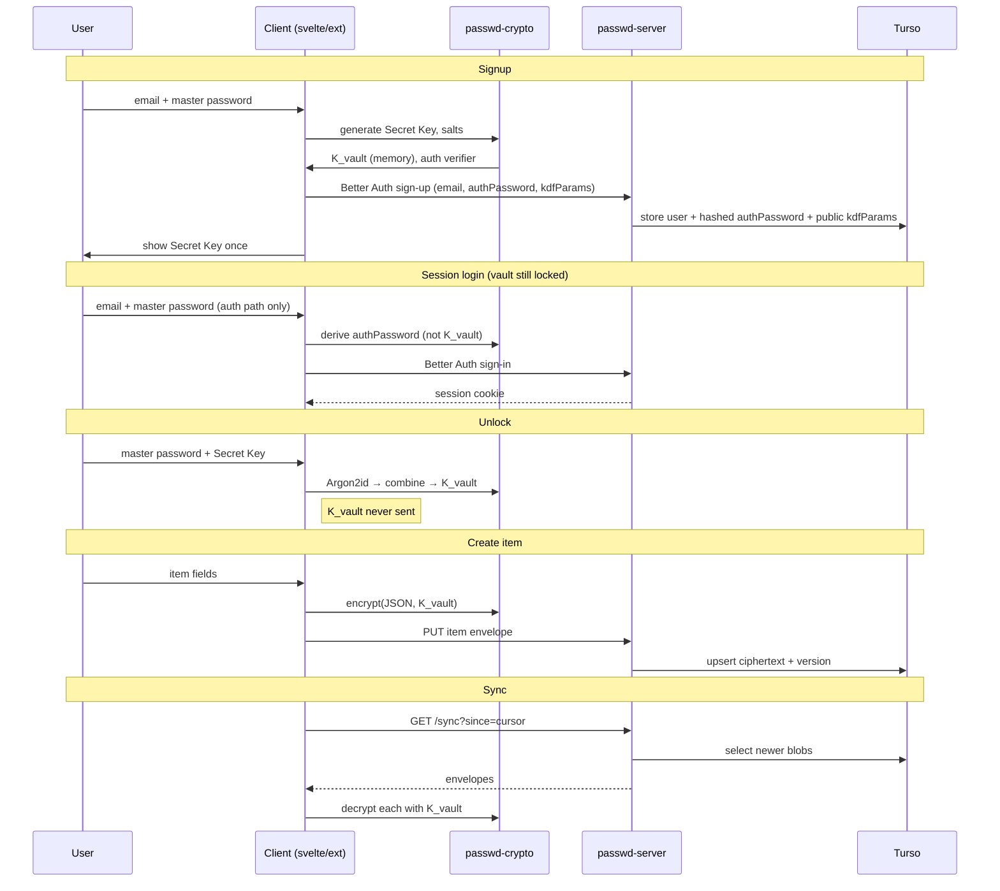

# Data flow — signup → vault → sync

```mermaid
sequenceDiagram
  participant U as User
  participant C as Client (svelte/ext)
  participant K as passwd-crypto
  participant S as passwd-server
  participant T as Turso

  Note over U,T: Signup
  U->>C: email + master password
  C->>K: generate Secret Key, salts
  K->>C: K_vault (memory), auth verifier
  C->>S: Better Auth sign-up (email, authPassword, kdfParams)
  S->>T: store user + hashed authPassword + public kdfParams
  C->>U: show Secret Key once

  Note over U,T: Session login (vault still locked)
  U->>C: email + master password (auth path only)
  C->>K: derive authPassword (not K_vault)
  C->>S: Better Auth sign-in
  S-->>C: session cookie


  Note over U,T: Unlock
  U->>C: master password + Secret Key
  C->>K: Argon2id → combine → K_vault
  Note right of C: K_vault never sent

  Note over U,T: Create item
  U->>C: item fields
  C->>K: encrypt(JSON, K_vault)
  C->>S: PUT item envelope
  S->>T: upsert ciphertext + version

  Note over U,T: Sync
  C->>S: GET /sync?since=cursor
  S->>T: select newer blobs
  S-->>C: envelopes
  C->>K: decrypt each with K_vault
```

## Conflict policy (v1)

Last-write-wins on `updated_at`, then `version`. Soft-deleted tombstones sync to all devices.
